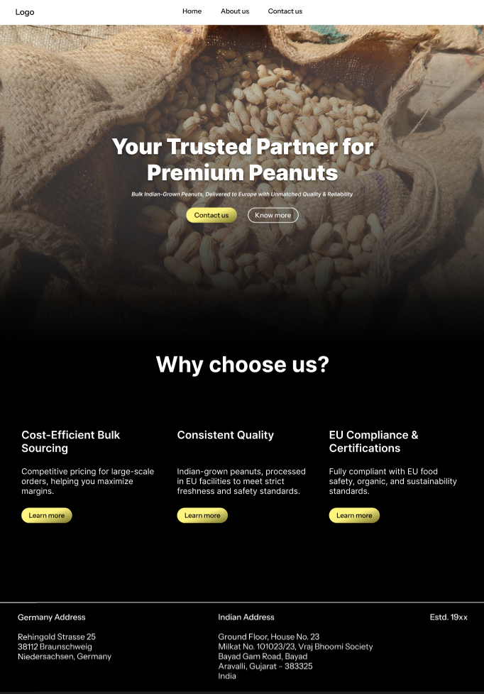
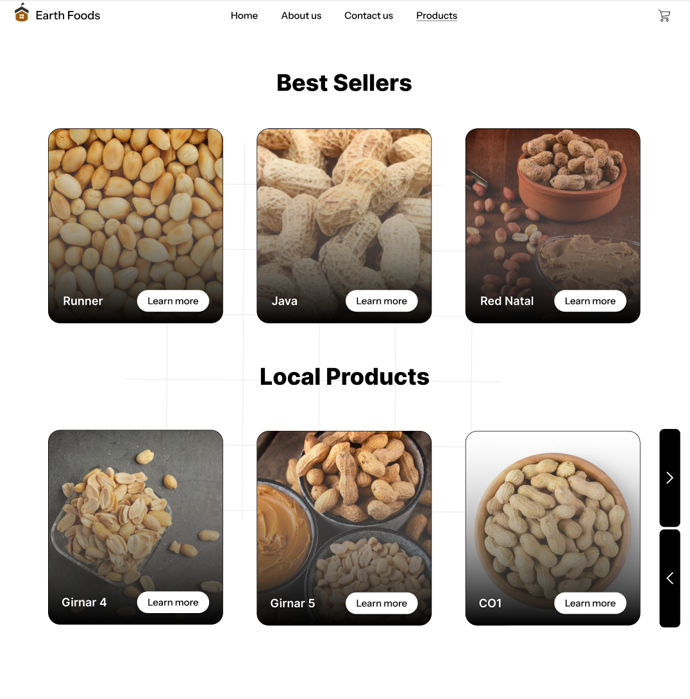
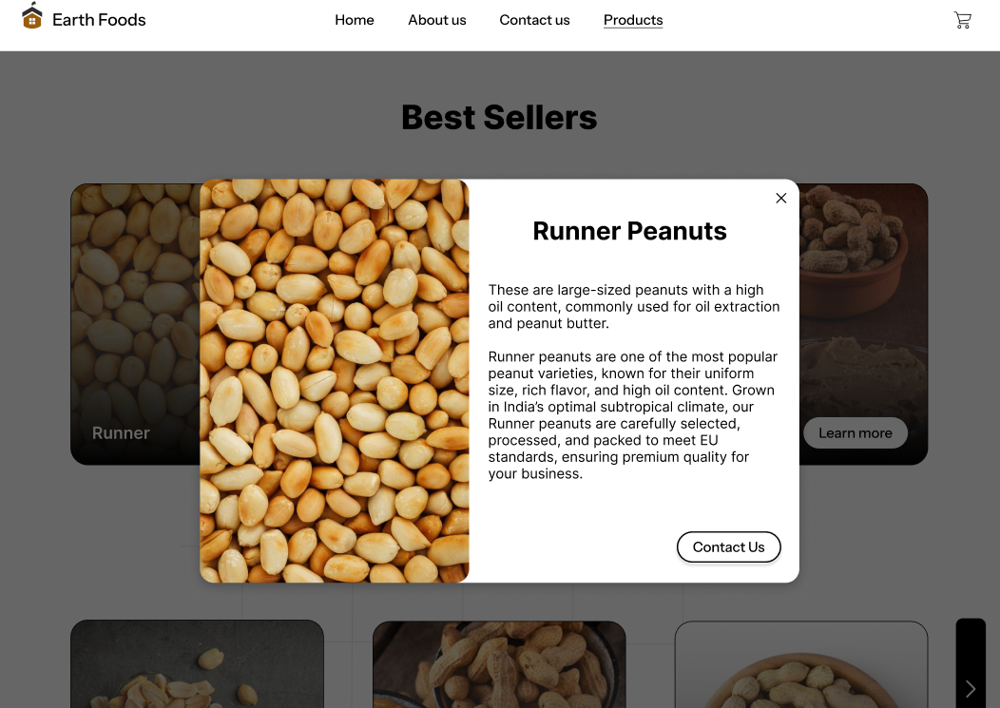
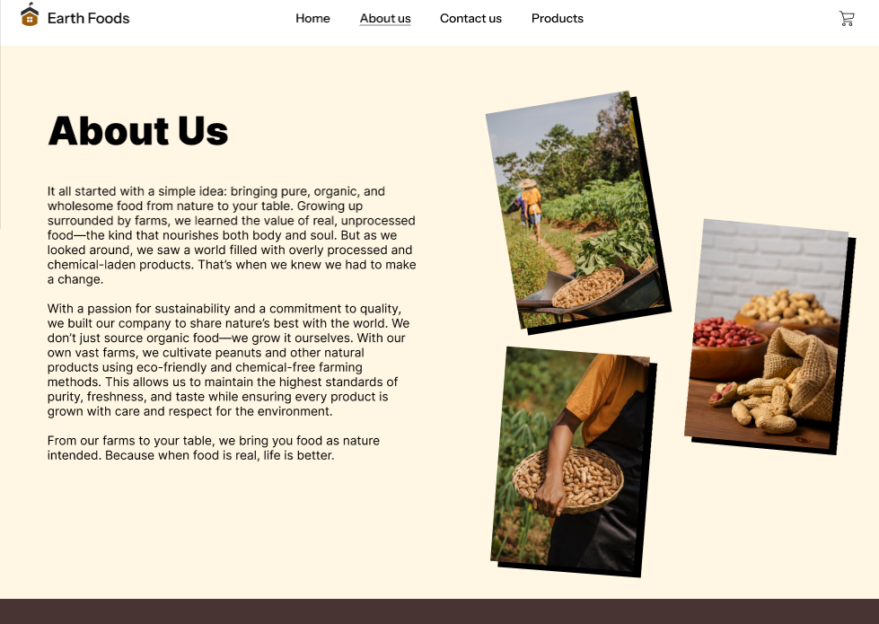
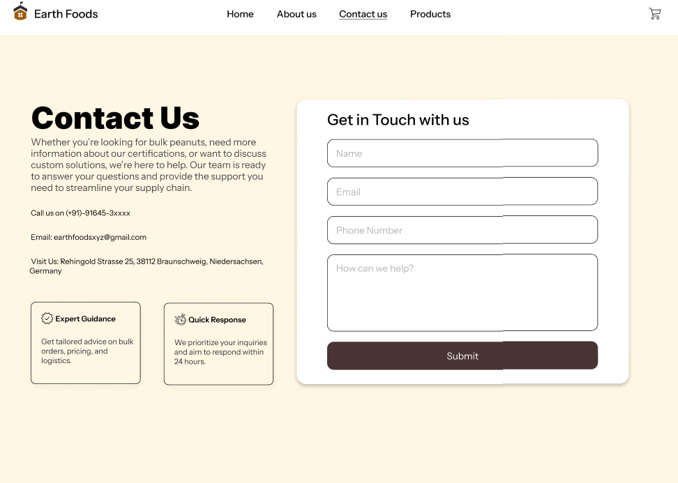

# 🥜 Earth Foods UI Design  

This repository showcases a complete **UI design** for a peanut business that exports its products to retailers and businesses. The design is crafted to provide a **modern, user-friendly, and professional** experience for visitors and potential customers.  

## 🌟 Features  

- ✅ **Landing Page** – A visually appealing homepage introducing the business.  
- ✅ **Products Page** – A showcase of the peanut products available for export.  
- ✅ **Product Detail Page** – A detailed showcase of individual peanut products.  
- ✅ **About Us** – Information about the company’s history, mission, and values.  
- ✅ **Contact Us** – A dedicated page for inquiries and business collaborations.  

## 📸 Screenshots  

### 🏠 Landing Page  
  

### 🛍️ Products Page  
  

### 📄 Product Detail Page  
  

### 🏢 About Us  
  

### 📞 Contact Us  
  

## 🎨 Design Approach  

The UI is designed with:  
- A **clean and modern layout** to enhance user experience.  
- **Responsive design** for seamless display across devices.  
- **Intuitive navigation** to ensure easy access to key information.  

## 🛠️ Tools Used  

- **Figma**  
- UI/UX best practices for accessibility and usability  

